# Build an e-learning portal with Watson Media.

The COVID pandemic has altered our conventional ways of working in companies, startups, businesses, and Educational Institutes. In the current times, to maintain social distancing, Schools and Colleges are choosing the e-learning platforms to impart education. Though, it started as a  precautionary measure to stop the further spread of the pandemic. But it is turning into a much more effective and efficient mode of teaching in terms of resources. More and more startups are emerging in the educational domain to make use of this window of opportunity.  Therefore, IBM brings forth **IBM Watson Media** to the developer community, which provides almost everything they need to build an e-learning platform for their startup. 

IBM Watson Media is an enterprise solution created by IBM to manage content and get insightful analytics on the videos uploaded using the service. It is a convenient, and an easy to use service which can be used for all your video on demand needs. It is built for scalability making it a perfect solution for streaming live events and product launches. Powered by IBM's cloud storage makes it reliable and Watson AI integration offers additional features like automated closed captioning and optimized video quality. Learn more about watson media [here](https://www.ibm.com/watson/media).

In this code pattern, we will demonstrate how to quickly build an **e-learning portal** using **Watson Media**.

After completing the code pattern, you understand how to:

- Create channels for different areas of learning. 
- Create and upload videos for a channel.
- Password restrict the access to videos.
- Restrict domains where the video can be embedded.
- Build a web application with authentication to access the channels using the APIs provided by Watson Media. 

The Scope of this Code Pattern is limited to following capabilities. **However, the Solutions can be scaled to accommodate a lot more functionalities andd capabilities through the Services, Products, Solutions and APIs provided by Watson Media.**  
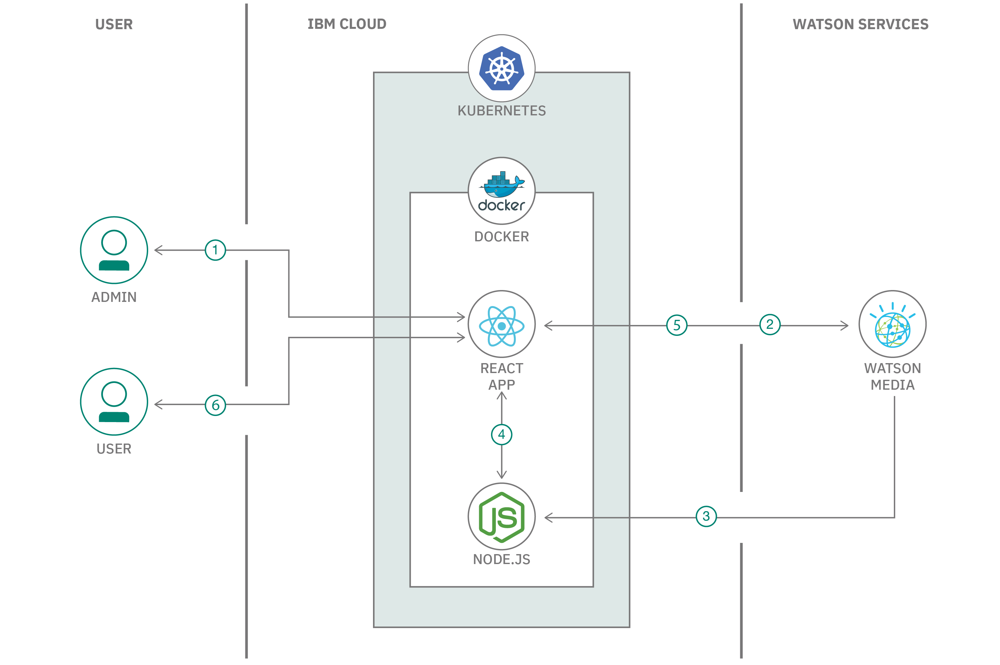

## Flow

1. Admin requests to authorizes the app
2. App is authorized by the IBM OAuth2.0 portal.
3. Node Server receives Auth token from Watson Media.
4. App requests server for the auth token
5. App uses auth token to create dashboard for user on runtime.
6. User logs in and accesses content published on Watson Media.

## Included components

* [IBM Watson Media](https://www.ibm.com/watson/media): It offers AI-driven solutions for live streaming events, corporate communication, video analytics, and content management.
* [Kubernetes](https://cloud.ibm.com/kubernetes/catalog/create): IBM Cloud Kubernetes Service creates a cluster of compute hosts and deploys highly available containers. A Kubernetes cluster lets you securely manage the resources that you need to quickly deploy, update, and scale applications.

## Featured technologies

* [Node.js](https://nodejs.org/en/): An asynchronous event driven JavaScript runtime, designed to build scalable applications
* [React](https://reactjs.org/): Javascript library for building User Interfaces
* [Docker](https://www.docker.com/why-docker): Docker is a set of platform as a service products that use OS-level virtualization to deliver software in packages called containers.


# Watch the Video

[](https://youtu.be/dcW0lAgpQ_I)


# Steps
1. [Login using IBMID on IBM Watson Media.](#1-login-using-ibmid-on-ibm-watson-media)
2. [Create the Channels.](#2-create-the-channels)
3. [Upload Videos on the Channel.](#3-upload-videos-on-the-channel)
4. [Create Playlists.](#4-create-playlists)
5. [Give Password Restriction on the Channel.](#5-give-password-restriction-on-the-channel)
6. [Generate Channel API credentials](#6-generate-channel-api-credentials)
7. [Deploy the Application.](#7-deploy-the-application)
8. [Run the Application.](#8-run-the-application)

## 1. Login using IBM ID on IBM Watson Media.
If you don't have IBM ID,  create an account on IBM Cloud Account 
- Login to [IBM CLOUD](https://cloud.ibm.com/login).

using the same ID, 
* Click on Start Streaming Video Trial on [Watson Media Page](https://www.ibm.com/watson/media)
* Login using IBM ID. Your 30 days free trial of the product will be activated.
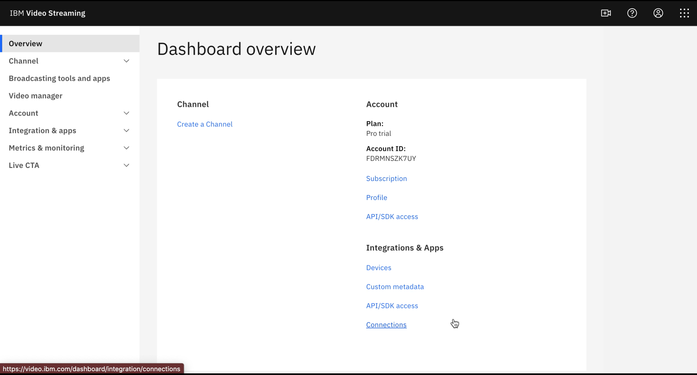

## 2. Create the Channels.
Channels help us in organizing our content, we can group content by any metric as per our requirement like subjects or audience. This will make the videos more convenient to locate and also will be helpful when determining what videos can be accessed by a particular user.


* In the left panel, under **Channel** click on **Create Channel**.

* In the **Title** field, enter your channel name, and under **Language of videos and broadcasts**,
select your desired language, finally click on **Create** as shown.


>Note: Free Trial allows you to create only one channel, you need to upgrade to premium account to create more.

>Note: You can view the Channel Page by clicking on the View Channel Page in the left panel.


## 3. Upload Videos on the Channel.
* Click on **Videos** on the left panel. 
* Click **Upload** button.
* Select all the files you want to upload from the computer,
you can also give it a name and description and click on **Start Upload** button to upload the video on Watson
Media.
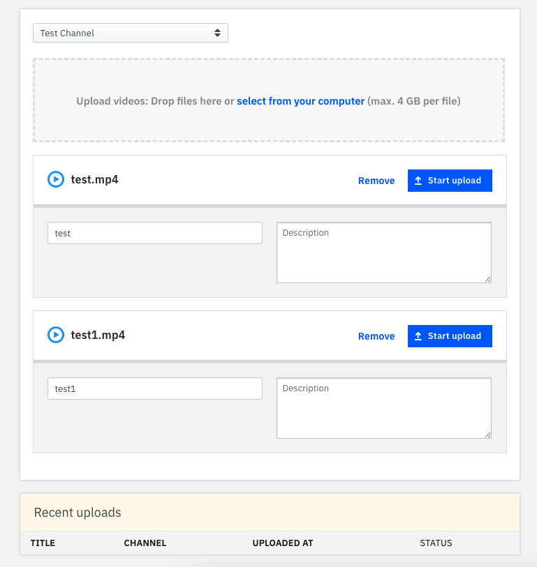


>Note: Uploading videos will take some time based on your internet bandwidth, please be patient for the upload to complete and watson media to process it.

* Click **Start to Upload** Button. 
* After the upload is complete, Go back to Dashboard, click on **Channel > Videos**, select all the uploaded videos and Hit Publish.
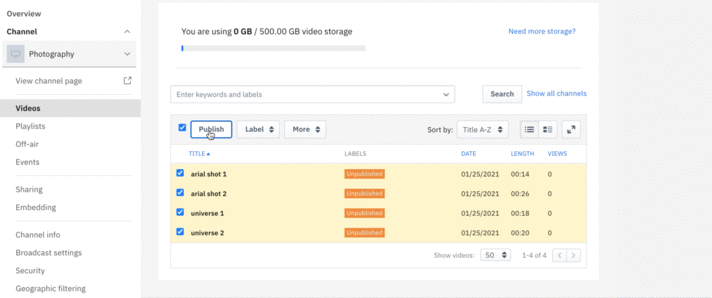


* You will see a message popup saying the selected videos are published.

>Note: Maximum storage of 500GB storage is available in lite plan to upload more content than that you will have to subscribe to a premium plan.


## 4. Create Playlists.
Playlists can be used to group videos together which are related and can be watched one after another. They are helpful for increasing user watch time and for making convenient go to content so viewer doesn't have to spend time in finding different videos pertaining to a similar topic.

* Click on **Playlist** on the left panel. 
* Click **Create Playlist** button.

* In the **Title** field, enter your playlist name, and click on **Create playlist** as shown.
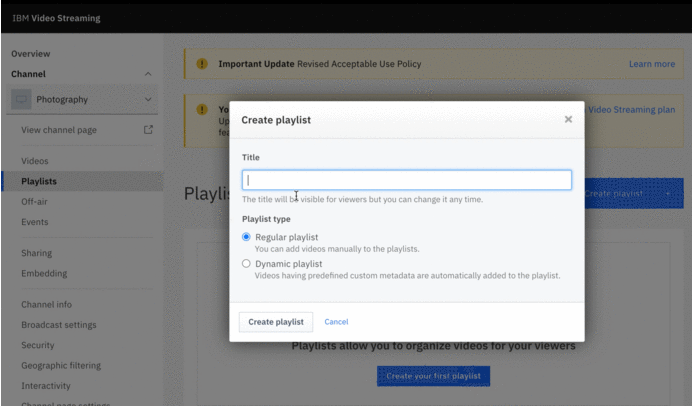

* You will see a modal to add videos to playlist, click on **add to playlist** to add that video to the playlist and press done as shown to create it.
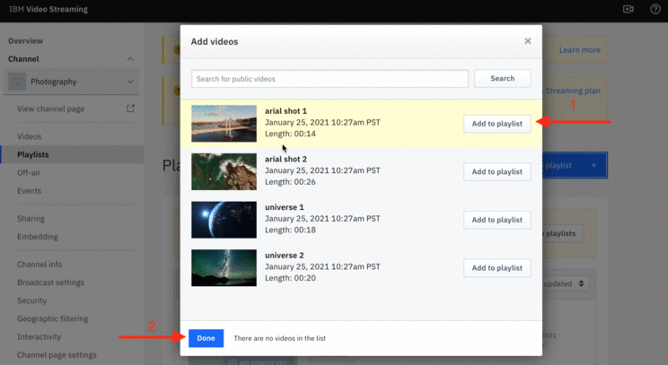

* You will see a message popup saying **Playlist Created**.


## 5. Give Password Restriction on the Channel.
Watson Media gives us the ability to secure our content with a password. This added layer of security makes sure that no undesired party has access to the content. 

* On the Dashboard, Click on **Security** Tab on the left panel.
* Click on **Settings** next to **Password Protection**.
* Check the **Enable Password Protection** button.
* Give the Channel Password of your choice and hit **Save**. 
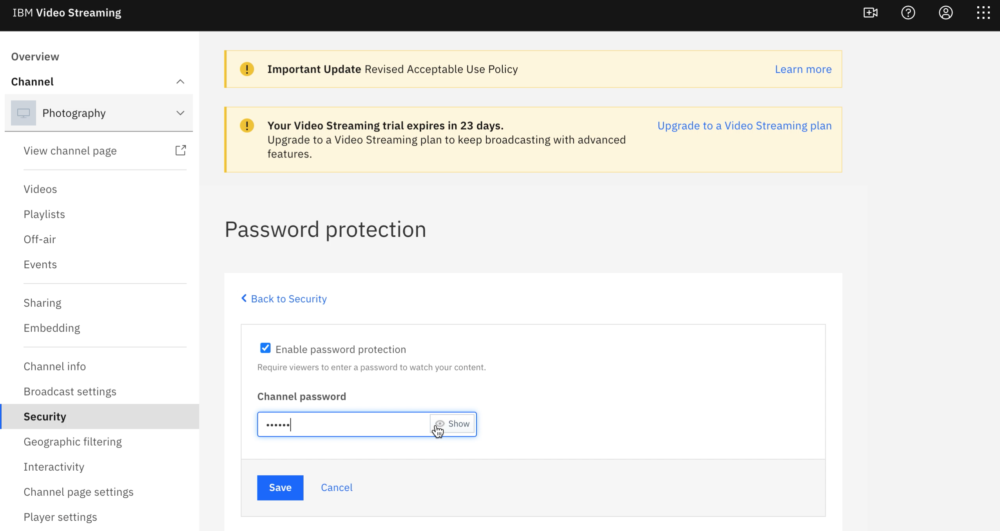 


## 6. Generate Channel API credentials

In this step you will learn to the use of Channel API for building custom UI and dashboard for managing and sharing content. It shows the workflow and step by step usage for integrating the API which can later be used for defining your custom apps.

  * From the left panel click on **Integration & apps > API/SDK Access**
  * You will be asked to login, click on **login with your IBMid**
  * Click **Create Credentials** to create Channel API credentials.
  * Enter an **Application Name** as per choice.
  * Enter http://localhost:8080/get_token as the Redirect URL.
  * Select **Web Application** from the radio as the application type.
  * Click on Save.
  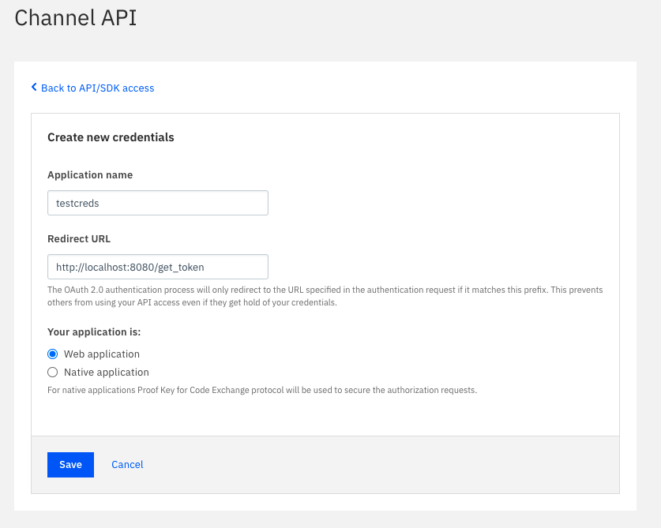

  * Once the credentials are created copy the `Client id` as it will be required in the next step.
  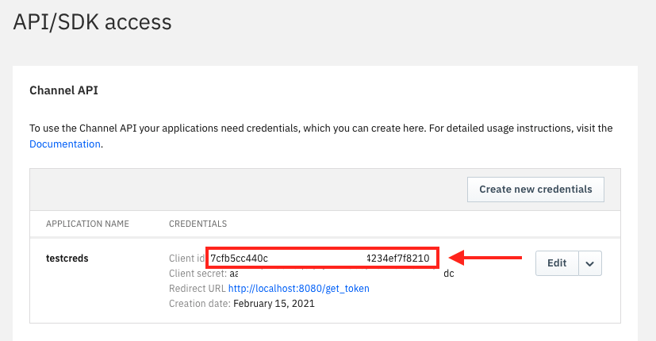


  ## 7. Deploy the Application
  <details><summary><b>Deploy Locally</b></summary>

  * Inside the `Code` directory run the following command
  ```bash
  npm install
  ```

  * After node modules have been installed run the following command 
  ```bash
  node server.js
  ```
  After this the application is listening on http://localhost:8080/

  </details>
  <details><summary><b>Deploy on Kubernetes</b></summary>

  #### Create a free Kubernetes Cluster on IBM Cloud

  * Create a free Kubernetes Cluster Account on https://cloud.ibm.com/kubernetes/catalog/create
  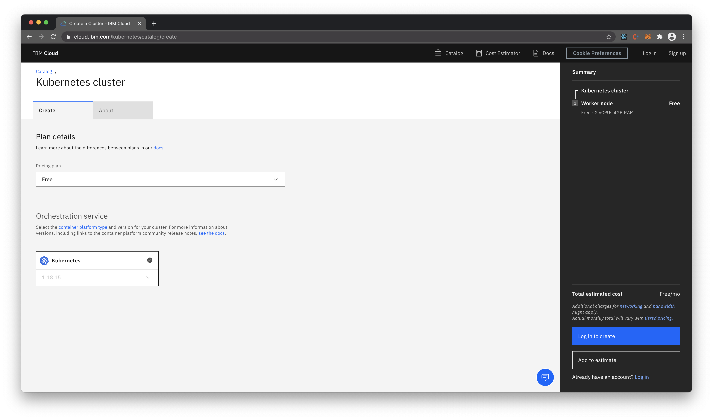

  * Connect your terminal to IBM Cloud using the following commands
  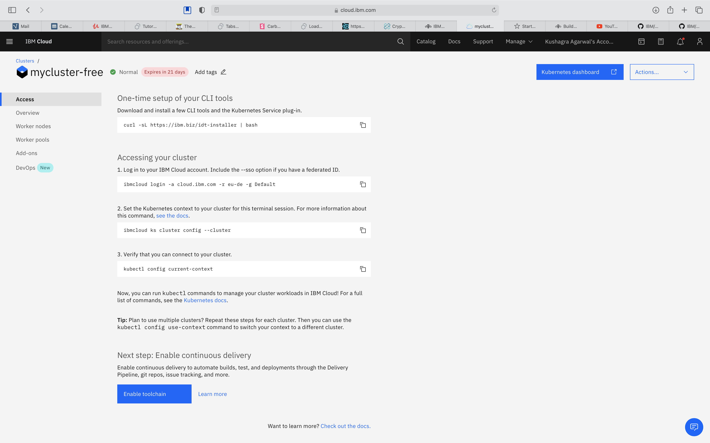

  * Click on worker nodes in the left navigation bar and copy your public IP.
  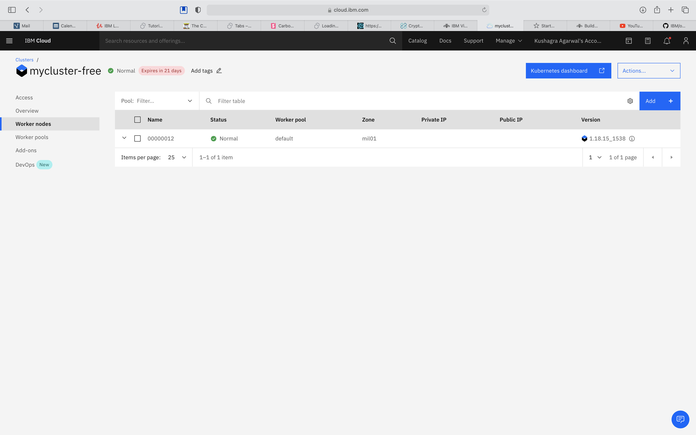


  #### Build and push Docker Image to Docker Hub.
  * Inside the directory `Code` run the following command
  ```bash
  docker build -t <DOCKERHUB_USERNAME>/<IMAGE_NAME>:<TAG> .
  ```

  The command should look like this
  ```bash
  docker build -t randomUser/watson-media-node:v2 .
  ```

  * After docker image is built, push it to docker hub using the following command
  ```bash
  docker push <DOCKERHUB_USERNAME>/<IMAGE_NAME>:<TAG> 
  ```

  * Inside the directory `Code`, change `deploy.yaml` file replace line no. 17 to
  ```bash
  image : <DOCKERHUB_USERNAME>/<IMAGE_NAME>:<TAG>
  ```
  It should look something like this 
  ```bash
  image: randomUser/watson-node-elearning:v2
  ```

  #### Deploy on Kubernetes

  * Next run the following command to deploy the image to kubernetes.
  ```bash
  kubectl apply -f deploy.yaml
  ```
  The Application is now running on your kubernetes node.

  * Go to your Watson Media API/SDK Access Dashboard and change the Redirect URL to http://<YOUR_KUBERNETES_NODE_PUBLIC_IP>:32423/get_token
  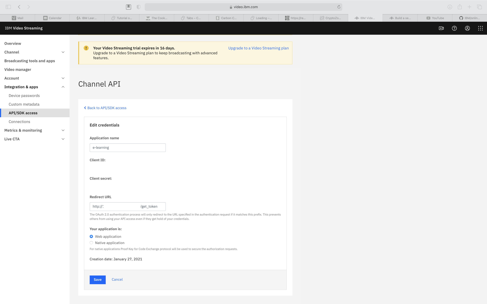


  After this the application is listening on http://<YOUR_KUBERNETES_NODE_PUBLIC_IP>:32423
  >NOTE: We have entered **32423** as this is the one that we have exposed in our `deploy.yaml` file.

  </details>

  ## 8. Run the Application.


  * Open your web browser and visit the app URL obtained in step 7. 
  
  * You will be redirected to `/admin` . Here enter the Client ID that you previously copied in step 6, and click **Authorize Access to Videos** as shown in the screenshot.
  

>Note: `/admin` page is to be accessed by the API owner who is giving the permission for the application to use the API and access the channel content. The application is accessible only if the person authorizes the application using the credentials permitted.

  * This will redirect you to Watson Media OAuth and you will be required to login with your W3, UStream or Device Credentials.
  * Click on **Login with your IBMid** to continue the auth process.
  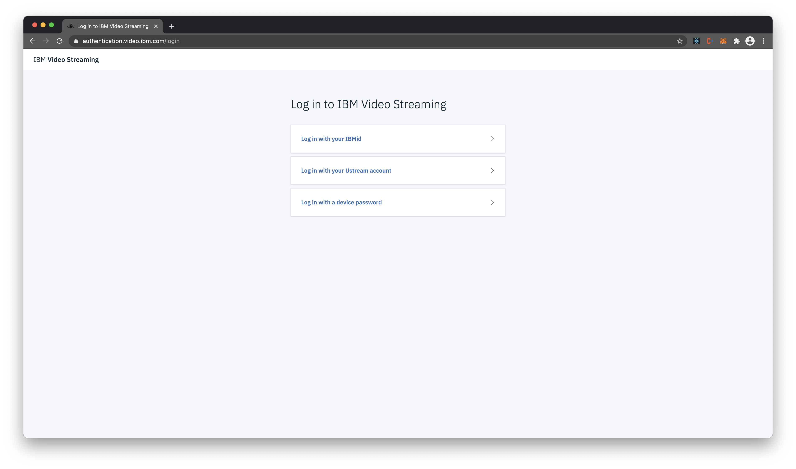

  * After logging in, click **Authorize.**
  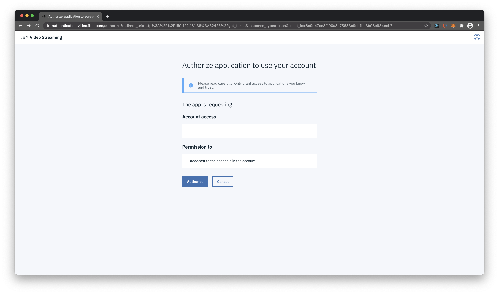

  > Successful Authentication will redirect you to `/login` 

  
  >Note: `/login` page can be accessed by anyone who wants to access channel content with the credentials provided or created on the portal as per admin's choice.
  

  * Here the user is required to enter the login credentials managed by the developer. For demonstration we are using the credentials stored in [`Code/React UI/src/content/sampleLogin.json`](https://github.com/IBM/Build-an-elearning-portal-with-Watson-Media/tree/main/Code/React%20UI/src/content/sampleLogin.json)

  
  * Look them up and enter it in the text boxes on `/login` and click Login.
  

  * After successfully logging in you can now view the different channels that you have created in Watson Media.
  
  
  * Select the channel and you can view the videos and playlists uploaded in that channel.
  

## (Optional) Build / Modify UI
todo

## (Optional) Restrict Domains where video can be embedded
Restrict Domain helps us in making sure that no party is embedding our content without permission. This protects from misuse and unauthorized use of the content.
* On the Dashboard, Click on **Security** Tab on the left-side panel.
* Click on **Embed Restriction**
* Check the **specify the domains where your streams can be embedded** button.
* Give the domains where you want to allow or restrict and hit **save**. 
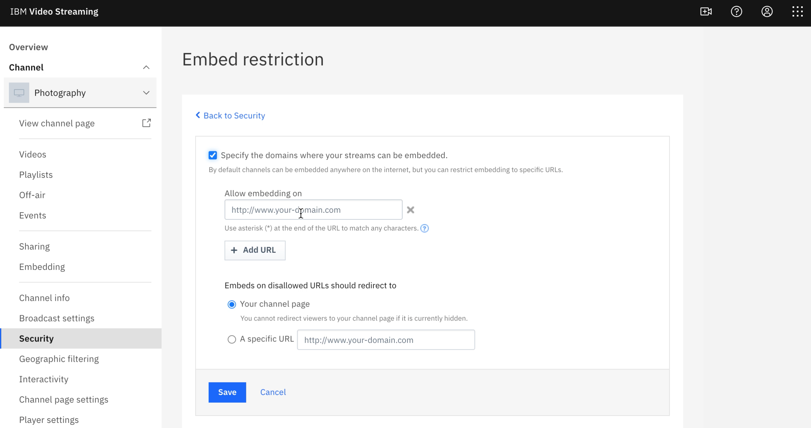

# Summary
todo
At the end of the code pattern you will have learnt how to ...

## License

This code pattern is licensed under the Apache License, Version 2. Separate third-party code objects invoked within this code pattern are licensed by their respective providers pursuant to their own separate licenses. Contributions are subject to the [Developer Certificate of Origin, Version 1.1](https://developercertificate.org/) and the [Apache License, Version 2](https://www.apache.org/licenses/LICENSE-2.0.txt).

[Apache License FAQ](https://www.apache.org/foundation/license-faq.html#WhatDoesItMEAN)
